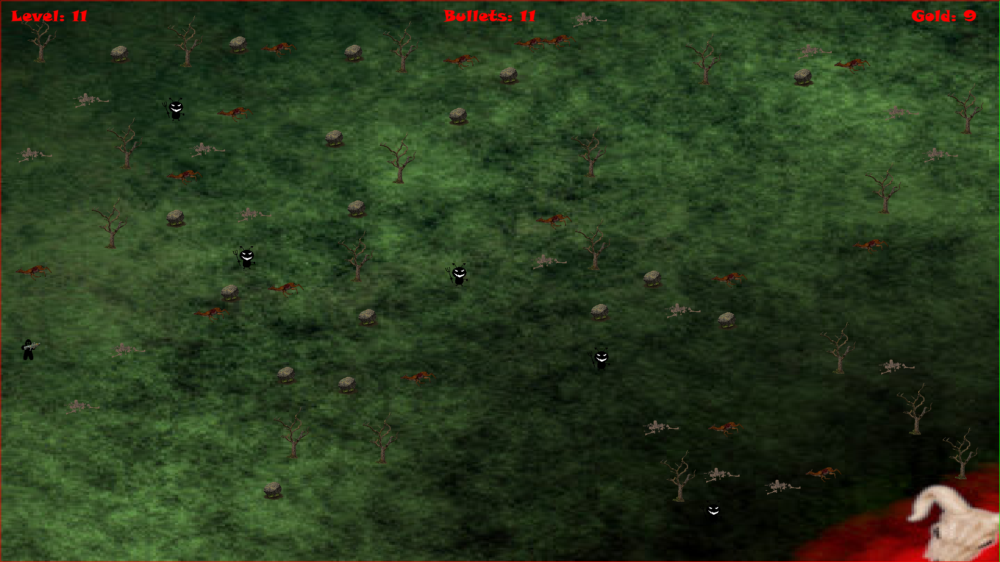
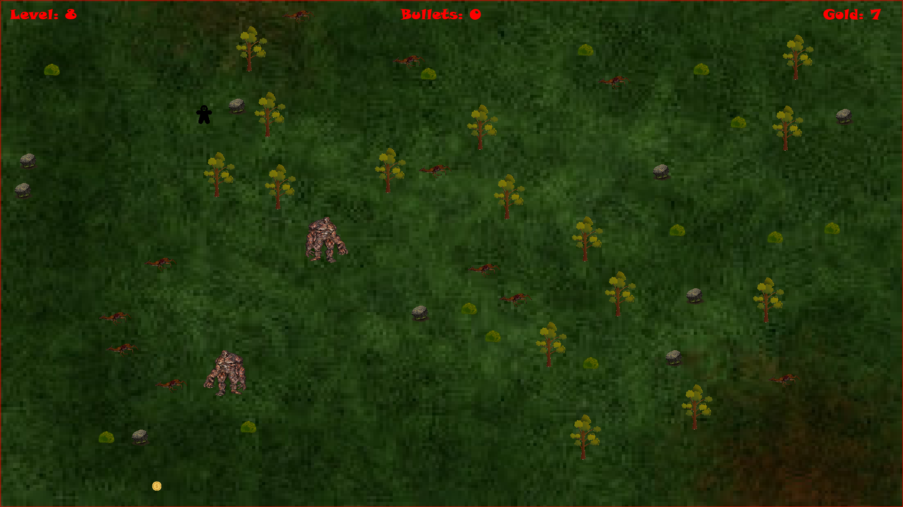
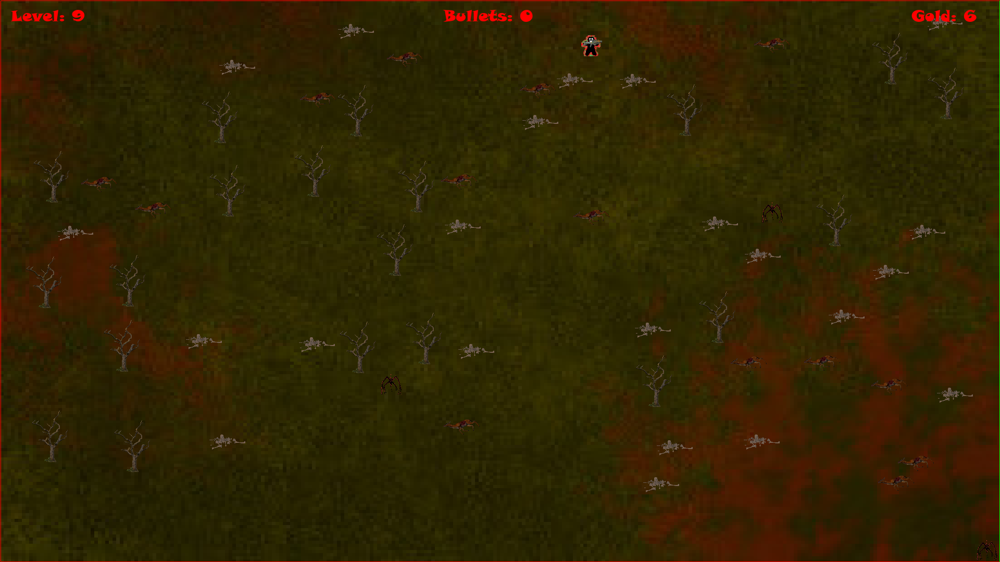

# Dark forest 

# Description
My first project in Python

You have to try survive the most number of levels. Before going to the next level you have to pick up gold in actualy level. When you pick the gold go to the right border of map. You can buy equipmend in shop, destroy obstacles and killing monsters. Press `m` in game to show more tips. Game have infinite number of different levels. Every 50 levels you can find boss.

## License
Application is licensed under the MIT License.

# Instalation

## Copying the repository

```
git clone https://github.com/0lch4/Dark_forest.git
```

## Installing the liblaries

```
pip install pygame
```

# Exe version:
https://drive.google.com/drive/folders/18XJt7mrsq8PtlCFCOp9l-pUfNfoBimPy?usp=sharing

# Client avilable now:
https://github.com/0lch4/Dark_forest_client

## New versions will only be released for client
But i will still repair bugs if someone find it.

# Sources:
Sounds an textures i find in the internet, some of it i edited.

# Screenshots




